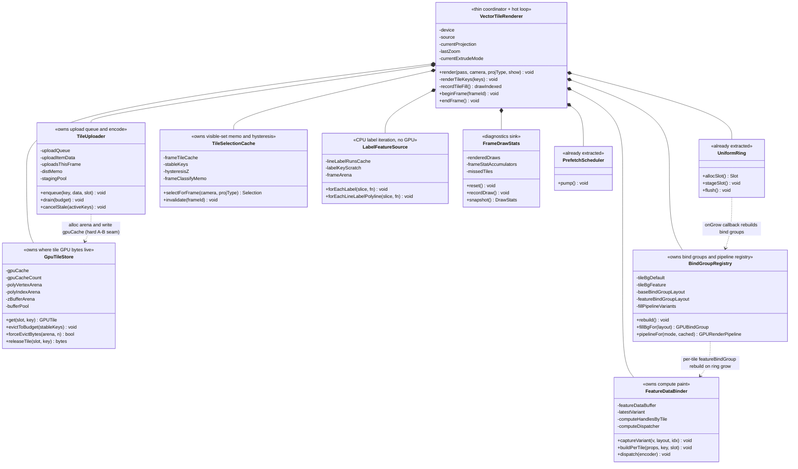

# Design Proposal — God-object decomposition strategy (portfolio)

> **STATUS: DESIGN PROPOSAL — NOT YET IMPLEMENTED.**
> This is a _portfolio_ strategy for the six god-objects flagged as X-GIS's #1
> architectural debt in [MODULES.md §4](../MODULES.md). It is the big-picture
> companion to the deep single-object drill in
> [vtr-decomposition.md](./vtr-decomposition.md): it states the shared method,
> ranks all six by risk × value × coupling, and recommends the order to tackle
> them. No production code is changed by writing this. Every "X owns Y" claim
> below traces to a real field/method read out of the source — identifiers are
> exact, not paraphrased.
>
> **Cross-links:** [MODULES.md](../MODULES.md) §4 (god-object list + LOC),
> [class-render-subsystem.md](../diagrams/class-render-subsystem.md),
> [sequence-frame-render.md](../diagrams/sequence-frame-render.md),
> [sequence-tile-lifecycle.md](../diagrams/sequence-tile-lifecycle.md),
> [vtr-decomposition.md](./vtr-decomposition.md) (the VTR drill this proposal
> points to for the #1 pilot detail),
> [ADR-0001](../../adr/0001-ecef-tile-pipeline.md) (uniform byte layout),
> [ADR-0003](../../adr/0003-shader-dsl-single-emit.md) (byte-drift gate +
> `PROJECTIONS` SoT), [ADR-0004](../../adr/0004-verification-gate-strategy.md)
> (the two-tier gates this decomposition must keep green),
> [ADR-0005](../../adr/0005-synthetic-earth-surface-background.md) (synthetic-bg
> cross-ownership hazard in map.ts), [ADR-0006](../../adr/0006-world-copy-rendering.md).

---

## 1. Why — the god-object debt

[MODULES.md §4](../MODULES.md) names six classes that _dominate the engine by
size and method count and own state that should be distributed_, and calls this
the **#1 architectural debt: unclear state-ownership**. The grounded numbers
(LOC exact `wc -l`; method counts approximate):

| Class              | File                             | LOC  | ~Methods                                                   |
| ------------------ | -------------------------------- | ---- | ---------------------------------------------------------- |
| VectorTileRenderer | `render/vector-tile-renderer.ts` | 5608 | ~62 top-level (MODULES counts ~237 incl. nested/overloads) |
| XGISMap            | `map.ts`                         | 2956 | ~160                                                       |
| TextStage          | `text/text-stage.ts`             | 1967 | ~27 (MODULES ~66 incl. accessors)                          |
| MapRenderer        | `render/renderer.ts`             | 1947 | ~82                                                        |
| TileCatalog        | `data/tile-catalog.ts`           | 1388 | ~44 (MODULES ~109)                                         |
| Camera             | `projection/camera.ts`           | 1210 | ~21 (MODULES ~41)                                          |

A prior decomposition review
(`project_godfile_decomposition_review_2026_05_30`) and the master plan
(`.omc/plans/master-plan-2026-05-30.md`) reached the same root and remain
**unexecuted** — these files are still monolithic. The executed _slices_ of
that direction are the `projections-table.ts` authority flip
([ADR-0003](../../adr/0003-shader-dsl-single-emit.md)) and the `@xgis/shared`
ECEF re-export; the god-file splits themselves are not done.

### The user's ownership principle (Unreal-tier)

> Kill god-objects by extracting **ownership**, not code. A god class = unclear
> state-ownership; the fix is to define _who owns each piece of state_, give it
> a narrow interface, and let the former god class shrink to a thin coordinator
> that wires the owners and holds only the order.

This is the lever for all six. The review independently named the same
mechanism: **composition (inject a state collaborator) is the dominant fix;
inheritance is nowhere; mixins are exactly one place** (the `map.ts` Mapbox-API
facade). LOC reduction is a _consequence_ of moving ownership, applied as a
"grandfather + shrink-only" ratchet — never the goal. A blind ≤500-line chase
_hurts_: it would split hot loops and the intentionally-cohesive uniform layout.

### The working precedent

The pattern is already proven _in this codebase_, twice over:

- **Orchestration lifts out cleanly.** The render passes were extracted from
  `XGISMap.renderFrame` into a stateless `RenderLoop` + `render/passes/*`
  (`opaque-pass` / `oit-pass` / `translucent-pass` / `points-pass` /
  `label-pass` / `overdraw-compose-pass`) — stateless singletons that reach
  renderers through a typed `host: RenderLoopHost` view
  ([class-render-subsystem.md](../diagrams/class-render-subsystem.md)). This is
  the template: the god-object becomes the host reference; the orchestration
  becomes stateless objects.
- **Owned state lifts out cleanly.** Inside VTR itself, `UniformRing`
  (`render/uniform-ring.ts`) and `PrefetchScheduler`
  (`render/prefetch-scheduler.ts`) are _already_ extracted owners with narrow
  interfaces, each receiving its caller-side policy via a callback (`onGrow` for
  the ring's bind-group rebuild; the frame-tile-cache shape for prefetch). The
  byte _layout_ stayed with VTR; only the _buffer lifecycle_ moved.

So this proposal is **not a new architecture — it finishes one already in
motion**, applying the same composition pattern to the remaining state clusters
across all six classes.

---

## 2. Shared decomposition method

One method applies to every object. The differences between the six are only in
_where the seams are clean_ and _which gate proves each cut_.

### Step A — extract by STATE OWNERSHIP into narrow-interface owners

For each god-object, group its private fields by _the cluster that mutates
them_, then give each cluster a class that is the **sole writer** of that state,
exposing verbs (not fields). The litmus is "who owns this piece of mutable
state": a field touched by exactly one cluster is a clean owner candidate; a
field touched by three clusters is a _shared-state hazard_ (§ each object below)
that must stay on the coordinator or be passed by reference.

### Step B — the class becomes a thin coordinator

The former god-object keeps: external refs (`device`, `source`, `camera`), the
per-frame _order_, the per-frame paint scalars it stamps into uniforms, and the
public entry methods whose signatures are the **contract boundary** (they must
stay byte-stable so callers are untouched). It _holds one of each owner_ and
wires them. This mirrors `RenderLoop`: the coordinator owns ORDER, the owners
own STATE.

### Step C — behavior-preserving, every cut verified by an existing gate

Per [ADR-0004](../../adr/0004-verification-gate-strategy.md), verification is
two-tier and that tiering _dictates which cuts are CI-safe_:

- **Tier 1 — CI, no GPU (SwiftShader, pure compute/compile).** `vitest` over
  `compiler`/`blueprint`/`runtime`; the `render-gate` job runs `_shader-math-parity`,
  `_wgsl-compile-gate`, `_vs-clip-parity`, `_dequant-parity`. The
  **polygon-variant byte-drift gate** (`polygon-variant-diff.test.ts`,
  [ADR-0003](../../adr/0003-shader-dsl-single-emit.md)) pins that the emitted
  GPU bytes stay identical. CPU-only cuts (e.g. map.ts patch-coalescing,
  TextStage shaping math, TileCatalog cache) are fully covered here.
- **Tier 2 — local / pre-push, real GPU (headed).** pixel-match survey,
  `_projection-label-onscreen` + `_label-anchor-parity` (label _position_, not
  pixels — pixel-match is non-gating for labels per ADR-0004 sub-decision),
  globe / non-Mercator render matrices, and the **autonomous
  screenshot-eyeball loop**. Any cut that touches the raster path (the
  GPU-memory triad) ships _alone_ with a warm-harness numeric perf comparison
  vs the Mercator control (`feedback_perf_numeric_verification`).

`bun run build` (tsc — vitest does not typecheck, per
`feedback_run_build_before_push`) gates every step. Each step is one PR;
authoring and the approval pass stay in separate lanes (no self-approval).

### What NOT to split (universal hazards)

These recur across the objects and are how a behavior-preserving refactor turns
into a regression:

1. **Hot loops.** VTR's `renderTileKeys` per-tile loop and TextStage's
   `prepare()` shaping loop read across _all_ their clusters by design — that
   is precisely what becomes the thin coordinator. Owners are _received as
   collaborators_; the loop body stays one method.
2. **Uniform byte layout.** VTR's `uniformF32[19..58]` / `uniformU32[36]` write
   at fixed float offsets the WGSL `Uniforms` struct reads by position
   ([ADR-0001](../../adr/0001-ecef-tile-pipeline.md)). Out-of-bounds typed-array
   writes are _silent no-ops_ in JS, so a split that drifts an index ships a
   shader-reads-garbage bug. The pack stays inline, in order, owned by the
   coordinator; the byte-drift gate pins it. MapRenderer's per-layer 192 B pack
   has the same property.
3. **Draw order.** Opaque → OIT → translucent-strokes → points → labels is
   fixed for correct alpha compositing
   ([sequence-frame-render.md](../diagrams/sequence-frame-render.md)); within
   opaque, 2D-fills-then-3D-extruded is load-bearing for high-pitch/globe depth.
   Decomposition invokes owners _within_ the existing order; it never reorders.
4. **Frame-lifetime aliasing.** Arena/`FrameArena` watermark views are
   live-borrowed into draws/`TextDraw` and valid only until the next
   `beginFrame`. The copy-on-store discipline (e.g. TextStage's
   `new Float32Array(view)` into the layout cache) must survive any owner
   boundary, or a view escapes the frame and silently corrupts.
5. **Hand-maintained accumulators.** TileCatalog's `_cachedBytes` and VTR's
   `_gpuCacheCount` are mutated in several places and must move _wholesale_ with
   their backing collection, or they desync (TileCatalog already shipped a
   263 MB false-eviction drift bug from exactly this, commit `497a2c1`).

---

## 3. The six god-objects

Each subsection: responsibilities → proposed owners → cleanest-first cut + its
gate → risk/value → coupling → shared-state hazards. A portfolio summary table
closes the section. **VTR is summarized here and drilled in
[vtr-decomposition.md](./vtr-decomposition.md) + §5.**

### 3.1 VectorTileRenderer (`render/vector-tile-renderer.ts`, 5608 LOC) — the #1 pilot

**Responsibilities (state clusters).** GPU tile cache (`gpuCache` nested Map +
`_gpuCacheCount` + the three `GPUArena`s `polyVertexArena`/`polyIndexArena`/
`zBufferArena` + `_bufferPool`); upload pipeline (`uploadQueue` PriorityQueue +
`uploadItemData` + `_uploadsThisFrame`/`_heldUploads*` + `doUploadTile`); uniform
ring (already `UniformRing`) + CPU mirror (`uniformF32`/`uniformU32`); pipeline
registry (12 `fillPipeline*` fields + setters); bind-group rebuild
(`tileBgDefault`/`tileBgFeature` + `rebuildTileBindGroups`); tile selection +
classification inside `render()` (`visibleTilesFrustum`/`globeVisibleTiles` +
`enumerateWorldCopies` + `classifyTile` + `_frameClassifyMemo`); label-anchor
iteration (`forEachLabelFeature`/`forEachLineLabelPolyline` + `_lineLabelRunsCache`);
compute (`computeDispatcher` + `computeHandlesByTile`); frame stats; and the
per-frame paint scalars (`cachedFillColor`/`currentOpacity`/`currentExtrude*`/
`currentPickId`/`logDepthFc`).

**Proposed owners.** `GpuTileStore` (cache + arenas + eviction), `TileUploader`
(queue + encode), `UniformRing` (exists), `BindGroupRegistry` (bind groups +
pipeline registry), `FeatureDataBinder` (compute paint), `TileSelectionCache`
(visible-set memo + hysteresis), `LabelFeatureSource` (CPU label iteration),
`FrameDrawStats` (diagnostics). The coordinator keeps `render`/`renderTileKeys`/
`recordTileFill`/`beginFrame`/`endFrame` + paint scalars. Full owner table,
sequence, and the post-decomposition class diagram are in
[vtr-decomposition.md §3](./vtr-decomposition.md).

**Cleanest-first cut + gate.** `LabelFeatureSource` (the `forEach*Label*` family

- `_lineLabelRunsCache` + `_frameArena`): touches only `source.getPropertyTable()`
- `stableKeys` + `_frameTileCache.neededKeys`, **zero GPU state** — the cleanest
  seam in the file. Verified by `_label-anchor-parity` (sub-pixel `ry` residual) +
  `_projection-label-onscreen` (the position gates ADR-0004 mandates for labels) +
  `merc-high-pitch-drag-perf.test.ts` (the runs-cache hoist must not regress).
  _Note:_ the original per-object analysis floated `PipelineSet` as the
  "mechanically cleanest" first cut; the VTR drill instead leads with
  `LabelFeatureSource`/`FrameDrawStats` and sequences the GPU-memory core last.
  This proposal follows the drill (see §4 reasoning + Disagreements log).

**Risk: high. Value: high.** Largest LOC win and the load-bearing render path.

**Coupling.** `render()`/`renderTileKeys` are invoked by the already-extracted
`RenderLoop` + `render/passes/*` per ShowCommand — the public `render()`
signature is the contract boundary and stays stable. Coupled to `TileCatalog`
(source-side, via `setSource`/`generateSubTile`/`requestTiles` — see 3.5),
`PrefetchScheduler` (extracted), `LineRenderer`/`PointRenderer` (separate),
`ComputeLayerHandle`/`ComputeDispatcher` (extracted), `MapRenderer` (consumes
its pipelines — see 3.4), and `map.ts` (the only wiring caller — see 3.2).

**Shared-state hazards.** The clean split breaks at the per-tile hot loop, a
genuine multi-owner critical section: `renderTileKeys` reads `layerCache.get`
(GpuTileStore), _writes_ `cached.lastUsedFrame` (cache LRU state, from the draw
path), packs ~40 fields into `uniformF32` (coordinator paint + cache-owned
`tileWest`/`dequantScale`), calls `allocUniformSlot` which may GROW the ring
mid-loop → `onGrow` → `rebuildTileBindGroups` → re-resolves `fillBg`
_after_ the slot alloc, and batches `strokeQueue` sharing one `slotOffset`
across fill+line. **Do not distribute the hot-loop body across FillDraw/LineDraw
owners** — fill and line are coupled by `slotOffset` + `strokeQueue` + the
single end-of-loop `flushUniformStaging`; that is the one split that will not
preserve behavior cheaply. `stableKeys` is the shared frame spine (read by evict

- label iteration + catalog evict; written by selection) and must stay
  coordinator-published. `_gpuCacheCount` moves wholesale with `gpuCache`.

### 3.2 XGISMap (`map.ts`, 2956 LOC) — public-API facade + wiring hub

**Already mid-decomposition.** `CameraController`, `SourceManager`,
`InteractionController`, `EventDispatcher`, `RenderLoop` are extracted
collaborators that receive XGISMap's state Maps _by reference_ (constructor
~498-538). The remaining bulk is lifecycle/build orchestration.

**Responsibilities.** Lifecycle/mount (`run`/`runBinary`/`load`/`destroy`/`stop`);
scene-build orchestration (`rebuildLayers`, the single largest method ~369 LOC,
routes each ShowCommand to raster/synthetic/vector-tile/point pipelines +
`_installSyntheticEarthSurfaceSource`); source/layer registry Maps
(`vtSources`/`vectorTileShows`/`rawDatasets`/`showCommands`/`xgisLayers`);
camera-API facade (~25 thin delegates, already lifted); style application
(`setBackgroundFill`/`setProjection`/`setPaintProperty`/dot-API); event
delegation; quality/RT lifecycle (`setQuality` re-wires every VTR's pipelines);
external-data injection (`updateFeature`/`flushPendingUpdates` + `_pendingPatches`

- `_featureIndex`); ~25 diagnostic passthroughs.

**Proposed owners.** `SceneBuilder` (the `rebuildLayers` body + variant-pipeline/
feature-buffer/compute-plan wiring — biggest LOC win); `MapLifecycle`
(mount/teardown + IR-pipeline glue + GPU init sequencing); `StyleController`
(runtime mutation — mostly already thin); `FeatureUpdateQueue` (external-injection
coalescing — `_pendingPatches`/`_pendingFlushHandle`/`_featureIndex`/
`_unknownSourceWarned`); `DiagnosticsFacade` (pure forwarders — lowest value).
XGISMap stays the thin facade (~600-800 LOC) holding the canonical state Maps as
the single owner-of-record; collaborators read by reference, never copy.

**Cleanest-first cut + gate.** `FeatureUpdateQueue` (`updateFeature`/
`flushPendingUpdates`/`scheduleFlushPendingUpdates` + its 4 state fields). Lowest
risk: those fields are touched _only_ by these 3 methods + the `_featureIndex.delete`
SourceManager callback + the `destroy()` guard. No GPU coupling — it mutates
`rawDatasets` feature objects in place then calls `teardownSource`+`rebuildLayers`
as injected callbacks (the SourceManager DI pattern already in the file). Verified
by `vitest` on the `updateFeature`/`setSourceData` characterization tests +
polygon-variant byte-drift (retile produces identical GPU buffers) + pixel-match
(no visual change). **CPU-only → fully covered by the no-GPU CI lane.**

**Risk: moderate. Value: high.**

**Coupling.** Tightly coupled to VTR: `rebuildLayers`/`setQuality`/
`_installSyntheticEarthSurfaceSource` each reach ~8-10 VTR setters
(`setBindGroupLayout`/`setExtrudedPipelines`/`setGroundPipelines`/
`setPatternPipelines`/`setOITPipeline`/`buildFeatureDataBuffer`/`setComputePlan`),
and the _identical 8-call setter ritual repeats verbatim 3×_. **Ordering: do the
VTR setter-collapse first** (a `configureFromRenderer(renderer)` on VTR), _then_
`SceneBuilder` lifts cleanly. Also couples to `MapRenderer`
(`getOrCreateVariantPipelines`/`getOrBuildVariantLayout`) and `RenderLoop`
(reads `showCommands`/`vectorTileShows`/`vtSources`/`camera` via host view — those
fields **must stay on XGISMap** as canonical owner).

**Shared-state hazards.** (1) Synthetic-earth-surface bg is cross-owned three
ways — `_backgroundColor`/`_syntheticBackend` written by `setBackgroundFill`
(StyleController), read+installed by `run`/`runBinary` (MapLifecycle), and
re-band-rebuilt by `setProjection` round-tripping through
`setBackgroundFill(null)`+`setBackgroundFill(rgba)`
([ADR-0005](../../adr/0005-synthetic-earth-surface-background.md)) — it resists a
single owner. (2) `vtSources` is written by `rebuildLayers` _and_
`teardownSource` _and_ the async GeoJSON-compile `.then()` (stale-supersede
guard) — concurrent ownership means `SceneBuilder` mutates it by reference; it
stays on XGISMap. (3) `setQuality` invariant
(`entry.pipelines===null ↔ entry.layout===null`, guarded by
`map-set-quality-invariant.test.ts`) is split across `setQuality` and
`rebuildLayers` — a shared contract, not a clean boundary. (4) `rebuildLayers`
is re-entrant (via `setProjection` + `flushPendingUpdates`) → `SceneBuilder` must
be stateless-re-callable.

### 3.3 TextStage (`text/text-stage.ts`, 1967 LOC) — label pipeline

**Responsibilities.** Submission API + per-label resolution (`addLabel`/
`addCurvedLineLabel`); the full Knuth-Plass wrap engine (`wrapWithKnuthPlass` +
module-global `_pretextCache`); vertical layout (`mlVerticalLayout`); atlas
lifecycle orchestration (eviction-drain → preload → overflow-guard, the
iter-268/272/273 stable-atlas invariant); point-label + curved-label shaping
loops; collision + precedence (`greedyPlaceBboxes` + `droppedPairKeys` hand-off
to IconStage); GPU emit (owns the `host`/`gpu`/`renderer` trio); caches
(`_layoutCache` + `_pretextCache`); diagnostics.

**Proposed owners.** `TextShaper` (point+curved per-label layout math — a pure
function of inputs; absorbs `wrapWithKnuthPlass` + `mlVerticalLayout` +
glyphOffsets/glyphRotations fill; ~700 LOC, the largest clean lift);
`LabelLayoutCache` (`_layoutCache` + hits/misses + atlas-generation guard);
`WrapCache` (promote the module-global `_pretextCache` to injected state —
_fixes_ the latent multi-instance aliasing the comments already worry about);
`AtlasAdmissionController` (the preload→overflow-guard sequence, encapsulating the
stable-atlas invariant); `LabelCollisionResolver` (sortKey-vs-reverse precedence

- `droppedPairKeys`); `TextDiagnostics` (pure sink). TextStage stays the thin
  coordinator owning the `host`/`gpu`/`renderer` trio + the `pending`/`pendingLine`
  queues; `prepare()` shrinks to an orchestration script (~300-400 LOC).

**Cleanest-first cut + gate.** `TextShaper` — it consumes immutable inputs and
produces a value (`TextDraw` + bbox), touching no instance mutable state. The
wrap + vertical pieces are _already pure and already test-seamed_ (`text-wrap.test.ts`
via `wrapForTesting`, `text-vertical.test.ts` via `verticalLayoutForTesting`,
`text-layout-edge.test.ts`). Verified by keeping those suites green byte-for-byte
after moving the functions behind a re-export, plus pixel-match/byte-drift on a
labelled OFM-Bright view. **CAVEAT — characterization tests first:** `prepare()`
has _no direct unit test today_ (only the helper seams do). Write
characterization tests for the layout-cache hit path, the overflow-drop path, and
the collision-precedence ordering _before_ cutting, so the orchestration
extraction is provably behavior-preserving. (This corrects the stale
"text-stage 0 tests" memory note — `text-stage.test.ts` exists and covers
`composeFontKey`/variable-offset/counters; the _orchestration_ is the gap.)

**Risk: moderate. Value: high.**

**Coupling.** To IconStage via `droppedPairKeys` (`getDroppedPairKeys`; ordering
contract: `TextStage.prepare` MUST run before `IconStage.prepare`, enforced in
`label-pass.ts`). To `map.ts` via ~10 diagnostic accessors. Owns three clean
collaborator subsystems (`GlyphAtlasHost`/`GlyphAtlasGPU`/`TextRenderer` — not
god-objects). Sole production caller is `render/passes/label-pass.ts`.
**No coupling to the other 5 god-objects' state** → can be sequenced
independently; a good standalone pilot after VTR.

**Shared-state hazards.** (1) module-global `_pretextCache` shared across all
TextStage instances — `TextShaper` is only truly "pure" once this is promoted to
injected `WrapCache`. (2) `_frameArena` watermark views (`advances`,
`glyphOffsets`, `baselineY`) are live-borrowed into `TextDraw` and valid only
until the next `beginFrame` — `TextShaper`, `LabelCollisionResolver`, and the GPU
emit share an implicit single-frame lifetime; the copy-on-store seam
(`new Float32Array(view)`) must be preserved. (3) `_layoutCache` stores live
`GlyphInfo[]` slot refs guarded only by `host.getGeneration()` — the cache owner
and the atlas-admission owner share the generation-bump invariant, enforceable
only through `host`. Net: extract owners but keep the **frame-lifetime +
atlas-generation invariants as an explicit contract**.

### 3.4 MapRenderer (`render/renderer.ts`, 1947 LOC) — pipeline factory + non-tile draw

**Responsibilities.** The live core is the **pipeline factory** (~640 LOC):
`initPipelines` builds ~40 polygon/line pipelines + OIT-extrude + OIT-compose +
lazy overdraw; `buildVariantDescriptors`/`createVariantPipelines`/
`getOrCreateVariantPipelines` + `shaderCache` produce per-`ShaderVariant` sets —
these ~25 pipeline fields are MapRenderer's _actual product_ that map.ts hands to
VTR. Plus: bind-group-layout authority (`bindGroupLayout`/`featureBindGroupLayout`
from static `FEATURE_LAYOUT_ENTRIES`/`PALETTE_LAYOUT_ENTRIES`); uniform-ring
lifecycle + palette/sprite atlas bind state; compute-layer registry
(`dispatchComputePass` is live, rest dormant); graticule overlay (default-off);
and a **production-dormant legacy non-tile draw arm** (`StyleProperties` +
`layers[]` + `addLayer` + `renderToPass`). `renderToPass` IS called every frame
(`opaque-pass.ts:155`), but its `layers[]` loop is empty in production (no legacy
non-tile layers registered), so the arm is **dormant-by-data, not dead code** —
the extraction target is the empty surface, not an uncalled method.

**Proposed owners.** `PolygonPipelineFactory` (the ~25 pipeline fields +
`shaderCache` + variant builders + the static layout entries + `bindGroupLayout`/
`featureBindGroupLayout` + free `buildShader` fn — highest value, the one thing
map.ts/VTR consume); `UniformRingHost` (ring + `beginFrame`/`endFrame`/
`allocUniformSlot`/`rebuildUniformBindGroups`); `PaletteAtlasState`
(palette/sprite views + sampler + setters); `ComputePaintRegistry`
(`computeDispatcher` + `dispatchComputePass`); `GraticuleOverlay` (self-contained,
default-off); `LegacyLayerStore` (**deprecate-and-delete candidate**, not a real
owner — confirm-dead and remove rather than re-home).

**Cleanest-first cut + gate.** `GraticuleOverlay` is the _lowest-risk_ cut (5
fields + 3 methods + 1 draw block, no shared mutable state with the pipeline
core, owns its own `WeakMap` GPU-buffer cache). Verified by the `_projection`
graticule on/off survey + the `setGraticuleEnabled`/`isGraticuleEnabled`
round-trip exercised by map.ts. **But it is also the lowest _value_** (~70 LOC,
default-off). The recommendation: prove the cut mechanism on `GraticuleOverlay`
(cheap, isolated), then spend the real effort on `PolygonPipelineFactory`, whose
gate is the **polygon-variant byte-drift snapshot** (US-010, renderer-shaders
byte-equal) + the SwiftShader `_wgsl-compile-gate` + the bind-group-drift
invariant test that reads the static layout entries _without a GPUDevice_ (those
statics were hoisted specifically so the test runs in CI — extraction-friendly by
design).

**Risk: moderate. Value: moderate.**

**Coupling.** MapRenderer is a **provider, not a peer**: VTR consumes its
pipelines (`setExtrudedPipelines`/`setGroundPipelines`/`setPatternPipelines`/
`setOITPipeline`) and binds against its layouts; the render passes
(opaque/translucent/oit) read `host.renderer.uniformBuffer` + overdraw pipelines
directly. So MapRenderer decomposition should **lead or run lockstep with VTR's**:
extracting a shared `PolygonPipelineFactory` is the natural seam that
de-duplicates the MapRenderer→VTR pipeline-handoff (the ~25 setter calls become
"VTR consumes `PolygonPipelineFactory`"). No coupling to TextStage/TileCatalog.

**Shared-state hazards.** The worst knot is the **bind-group co-ownership**:
`rebuildUniformBindGroups` + `setPaletteColorAtlas` + `setSpriteAtlas` +
`addLayer`'s per-layer bind-group build all (re)construct the _same_
`GPUBindGroup` objects from _three owners' state at once_ — `uniformBuffer`
(UniformRingHost), `paletteColorAtlasView`/`spriteAtlasView`/`paletteSampler`
(PaletteAtlasState), and `layer.featureDataBuffer` + compute handles
(LegacyLayerStore + ComputePaintRegistry). A `GPUBindGroup` is immutable and must
be torn down and rebuilt whenever _any_ input changes (ring grow, palette swap,
sprite swap). "Who owns the bind group" has no single answer — it is co-owned;
the honest resolution is a small shared `BindGroupAssembler` all three call, OR
the facade keeps `rebuildUniformBindGroups` as the coordination point. Also: the
static layout entries must stay statically importable (they are); `rebuildForQuality`
clears `shaderCache` then re-runs `initPipelines` then triggers map.ts's eager
re-resolve loop (cross-owner lifecycle ordering the facade must preserve).

### 3.5 TileCatalog (`data/tile-catalog.ts`, 1388 LOC) — tile router + cache + budget

**Responsibilities.** Backend registry + multi-backend dispatch (`attachBackend`/
`makeSink` + the `XGVTIndex` shell); the CPU `TileData` cache (`dataCache` nested
Map + `_cachedBytes` accumulator); tile-result ingestion (`acceptResult`/
`cacheTileData` + `onTileLoaded` fan-out to VTR); pending-load tracking
(`loadingTiles` Set); per-frame compile/sub-tile budget (count-floor + 6ms
time-ceiling); request dispatch + prefetch + cancellation
(`requestTiles`/`prefetch*`/`cancelStale` + `_prefetchKeys`/`_evictShield`/
`_skeletonKeys`); sub-tile generation (overzoom CPU clipping); cache eviction
(LRU + byte-cap + count-cap + `assertByteAccountingInvariant`).

**Proposed owners.** `TileDataCache` (`dataCache` + `_cachedBytes` +
`sizeOfTileData` — **the shared state object, extract FIRST**); `BackendRegistry`
(`backends[]` + `index` + `attach`/`detach`/`mergeBackendMeta`); `LoadTracker`
(`loadingTiles` — tiny, clean); `FrameBudget` (budget counters + `resetCompileBudget`);
`PrefetchScheduler` (the _messy_ owner — its `_prefetchKeys`/`_evictShield`/
`_skeletonKeys` protection sets are read by eviction, so it co-owns the eviction
decision). The catalog stays the thin facade VTR's `setSource(catalog)` depends
on (public API explicitly frozen per the file header); ingestion
(`acceptResult`/`cacheTileData`/...) likely stays coordinator-level glue because
it straddles registry + cache + load-tracker + fan-out.

**Cleanest-first cut + gate.** `LoadTracker` (`loadingTiles`): mutated only via
`trackLoading`/`releaseLoading` sink hooks + the `requestTiles` concurrency gate —
the lowest-risk owner to name explicitly. Verified by
`tile-catalog-multi-backend.test.ts` + `getTileState`. **CPU-only → no-GPU CI.**

**Risk: moderate. Value: high.**

**Coupling.** VTR is the primary per-frame driver (calls `resetCompileBudget`,
`requestTiles`, `generateSubTile`, `cancelStale`, `evictTiles`, `setFetchPriority`;
consumes `onTileLoaded` for GPU upload — catalog is GPU-independent _by design_,
which is why `sizeOfTileData` omits `prebuiltLineSegments`). Also to
`vector-tile-loader.ts` (`prewarmSkeleton` on attach) and the `sources/*`
backends (the `TileSource` interface). **Ordering: `TileDataCache` must be
extracted before eviction and ingestion** (both write `_cachedBytes`). This is
the data-layer counterpart to the VTR pilot → VTR and TileCatalog decomposition
should be **sequenced together** (shared `onTileLoaded` + per-frame-pump
contract).

**Shared-state hazards.** The cut is **not clean at the eviction boundary**:
`evictTiles` reads three protection sets owned by `PrefetchScheduler`
(`_evictShield`, `_skeletonKeys`, `_prefetchKeys`) AND mutates `dataCache`/
`_cachedBytes` (TileDataCache) AND reads `protectedKeys` passed by VTR — a genuine
three-way decision that must live on the coordinator or take explicit owner refs.
`_cachedBytes` is a hand-maintained accumulator with a _documented prior drift bug_
(commit `497a2c1`: 263 MB false eviction) → `setSlice` and `deleteCacheEntry`
**must stay welded in TileDataCache** with `assertByteAccountingInvariant`.
`makeSink` closures capture `this` and join three owners
(`trackLoading`/`releaseLoading` + `acceptResult` → registry + cache) → the sink
stays coordinator-level. `_skeletonKeys` is co-read by `cancelStale` and
`evictTiles` → cements PrefetchScheduler+eviction coupling. Net: LoadTracker +
BackendRegistry + FrameBudget cut clean; TileDataCache cuts clean only if
`setSlice`/`deleteCacheEntry`/`_cachedBytes` stay welded; eviction +
PrefetchScheduler resist a single-owner cut.

### 3.6 Camera (`projection/camera.ts`, 1210 LOC) — view/projection matrices

**Responsibilities.** Canonical camera _state_ (`centerX`/`centerY`/`zoom`/
`bearing`/`_pitch` + render-loop-pushed flags `globeMode`/`globeOrtho`/`projType`/
`azimuthalProjType` + bounds); flat 2D-plane MVP builder (`_buildRTCMatrix`/
`getRTCMatrix`/`getFrameView` + the `_cache*` shadow); ECEF/ENU + globe MVP builder
(`getECEFFrameView`/`_globeFrame` + `_ecefCache*`); projection routing
(`getViewForProjection`); screen→world unproject + picking (`unprojectToZ0`/
`unprojectToLonLat`/`unprojectToMercatorAnchor`/`_relToLonLat` +
`getRTCMatrixInverse`); world-copy enumeration (`getVisibleWorldCopies` + `_vwc*`);
interaction mutators (`pan`/`zoomAt`/`panToScreenAnchor`/`rotate`/`resetBearing`).

**Proposed owners.** `ViewMatrixBuilder` (the derived matrices + their caches —
reads state by reference, mutates nothing on the camera; the largest, cleanest
lift, consumed only by `tile-select.ts` + passes + shader-dsl);
`CameraController` (the gesture→state writes — _the hazardous cluster_, see below);
`Unprojector` (screen→world/geo — best kept a thin stateless helper taking
`(inverse matrix, centerX/Y, projType)`); `CameraState` (the irreducible mutable
core both owners reference). Because `Camera` is passed by reference everywhere,
the coordinator keeps the `Camera` class as state+facade, instantiates
`ViewMatrixBuilder(this)`/`CameraController(this)` internally, and delegates the
public methods one-to-one — preserving every call site
(`camera.getViewForProjection(...)`, `camera.pan(...)`) byte-for-byte.

**Cleanest-first cut + gate.** Extract the `Unprojector` cluster FIRST
(`unprojectToZ0` + `unprojectToLonLat` + `unprojectToMercatorAnchor` +
`_relToLonLat` + `getRTCMatrixInverse`): it is the single dependency shared by
_both_ future owners, it is pure-functional, and lifting it first **decouples the
builder from the controller before either is split** — removing the worst
shared-state edge up front. Verified by `ortho-unproject-parity.test.ts` +
`camera-z0-probe.test.ts` + `visible-world-copies.test.ts` +
`interaction-contract-gates.test.ts` + pixel-match + byte-drift. The one-to-one
façade delegation means controller/tile-select call sites stay untouched, so a
green run is a true byte-drift gate. **Mostly CPU/compute → strong CI coverage**
via `camera.test.ts`(43 hits) + the parity suites.

**Risk: moderate. Value: high.**

**Coupling.** To `projections-table.ts` SoT (`isGlobeProj`/`flatViewHeightCapM`/
`worldCopiesFor`/`enumerateWorldCopies`), `globe.ts` (`buildGlobeMatrix`),
`ecef.ts`, `camera-helpers.ts` (math kernels _already extracted_ — good
precedent). **Consumption is mostly split** (grep-confirmed): controllers consume
mutators+unproject; passes + shader-dsl consume matrix-builders. The one crossing
edge — `tile-select` reads BOTH `unprojectToZ0` (unprojector) and `getRTCMatrix`
(builder) — is exactly why Camera cuts into a STATE record + service objects that
reference it, NOT two independent peers (see Hazards); it strengthens the
Unprojector-first ordering rather than blocking it. **Ordering: Camera is the EARLY pilot** — clean external
read-boundary, lands BEFORE VTR/map.ts. The render-loop frame-push of
`projType`/`globeMode`/`azimuthalProjType` must keep targeting the `CameraState`
record → do Camera before/independent of map.ts.

**Shared-state hazards.** Builder and mutators are **not cleanly separable by a
wall** — coupled through three channels and resist a cut at exactly one cluster:
(1) `zoomAt`/`panToScreenAnchor` (controller) CALL `unprojectToZ0`/`_relToLonLat`
(Unprojector) which CALL `getRTCMatrixInverse`→`_buildRTCMatrix` (builder), then
_write_ `centerX/Y` which invalidates the builder's `_cache*` on the next build —
a bidirectional builder↔controller edge, not a DAG. `zoomAt` is the densest knot:
unproject→mutate zoom→re-unproject against the rebuilt matrix, _iterating 6× for
flat non-merc_ — three owners interleave inside one method. (2) The `_cache*`/
`_ecefCache*`/`_vwcCached` shadows are written by the builder but their
_correctness_ depends on every state field the controller mutates — splitting
forces the builder to re-read `state.*` by reference each build (fine, the cache
compares _values_; do NOT introduce a dirty-flag protocol). (3)
`projType`/`globeMode`/`globeOrtho`/`azimuthalProjType` are read by BOTH builders
and mutators → must stay in the shared `CameraState`, not migrate into either
owner. **Honest read: Camera decomposes into a STATE record + two stateless-ish
service objects that both reference it — not two independent peers.**

### Portfolio summary table

| God-object             | LOC  | ~Methods | Risk     | Value    | Cleanest-first cut (+ its gate)                                                                                               | Depends-on (decomposition coupling)                                                                 |
| ---------------------- | ---- | -------- | -------- | -------- | ----------------------------------------------------------------------------------------------------------------------------- | --------------------------------------------------------------------------------------------------- |
| **VectorTileRenderer** | 5608 | ~62      | **high** | **high** | `LabelFeatureSource` — `_label-anchor-parity` + `_projection-label-onscreen` + `merc-high-pitch-drag-perf`                    | RenderLoop/passes (contract = `render()` sig), TileCatalog, map.ts, MapRenderer, Line/PointRenderer |
| **XGISMap**            | 2956 | ~160     | moderate | high     | `FeatureUpdateQueue` — `vitest` updateFeature chars + byte-drift + pixel-match (CPU/CI)                                       | VTR (8-call setter ritual; collapse FIRST), MapRenderer, RenderLoop host fields                     |
| **TextStage**          | 1967 | ~27      | moderate | high     | `TextShaper` — `text-wrap`/`text-vertical`/`text-layout-edge` green + pixel-match (write `prepare()` chars FIRST)             | IconStage (`droppedPairKeys` order), label-pass (sole caller); **no other god-object coupling**     |
| **MapRenderer**        | 1947 | ~82      | moderate | moderate | `GraticuleOverlay` (prove mechanism) → real value in `PolygonPipelineFactory` — byte-drift snapshot + `_wgsl-compile-gate`    | VTR (provider→consumer; lead/lockstep), map.ts, passes                                              |
| **TileCatalog**        | 1388 | ~44      | moderate | high     | `LoadTracker` — `tile-catalog-multi-backend` + `getTileState` (CPU/CI)                                                        | VTR (per-frame driver; sequence together), loader, `sources/*` backends                             |
| **Camera**             | 1210 | ~21      | moderate | high     | `Unprojector` — `ortho-unproject-parity` + `camera-z0-probe` + `visible-world-copies` + `interaction-contract-gates` (CPU/CI) | projections-table SoT, globe/ecef/camera-helpers (kernels extracted); EARLY pilot                   |

---

## 4. Prioritized sequence — the recommended ORDER

The order optimizes **risk × value × coupling**, not raw LOC. Three principles
drive it: (a) prove the pattern on a _clean-boundary, CI-gated_ object before
risking the hot path; (b) respect coupling — never extract a consumer before its
provider's seam exists; (c) put the _highest-value-highest-risk_ object (VTR) in
the middle, after the pattern is proven and after its tightly-coupled neighbors
have de-risked their shared seams.

**Wave 1 — Camera (prove the pattern on the cleanest external boundary).**
Camera is the _early pilot_: its external read-boundary is the cleanest in the
portfolio (controllers consume mutators, passes consume builders, with the single
crossing edge being tile-select reading both sides), its math kernels are _already extracted_ to
`camera-helpers.ts` (precedent), and its first cut (`Unprojector`) is
CPU/compute → strongly covered by CI (`camera.test.ts` 43 hits + parity suites).
It lands _before_ VTR/map.ts because the render-loop frame-push targets its
`CameraState` record, so doing it first stabilizes that contract. **Why first:**
highest confidence-per-risk; proves the façade-delegation pattern under the gates
with the least chance of a raster regression.

**Wave 2 — TextStage (independent standalone pilot; build the missing test
seam).** TextStage has **zero coupling to the other 5 god-objects' state** — it
can be sequenced anytime. It comes second because (i) it independently proves the
pattern on a _different subsystem_ (text vs render-memory), and (ii) it forces
the discipline the portfolio needs: its `prepare()` orchestration has **no direct
unit test**, so Wave 2 begins by _writing characterization tests_ (layout-cache
hit, overflow-drop, collision-precedence) before any cut. Establishing
"characterization-tests-first" here, on a self-contained object, sets the norm
before the high-risk VTR work. First cut `TextShaper` is pure math, already
test-seamed.

**Wave 3 — MapRenderer `PolygonPipelineFactory` seam (de-risk VTR's provider).**
MapRenderer is VTR's pipeline _provider_. Extracting `PolygonPipelineFactory`
_before_ VTR's GPU-memory core does two things: it proves the mechanism on the
cheap isolated `GraticuleOverlay` first, then de-duplicates the MapRenderer→VTR
pipeline-handoff (the ~25 setter calls become "VTR consumes the factory"),
**shrinking the seam VTR and map.ts must later cross**. Gated by the byte-drift
snapshot + `_wgsl-compile-gate` (CI). This is the lockstep partner of VTR — do
its provider half here so VTR's consumer half is simpler in Wave 4.

**Wave 4 — VTR (the #1 pilot) + TileCatalog, sequenced together.** This is the
highest value and highest risk, placed _after_ the pattern is proven (Waves 1-2)
and _after_ its provider seam is de-risked (Wave 3). VTR and TileCatalog share
the `onTileLoaded` + per-frame-pump contract, so they move together. Internal
order within the wave follows [vtr-decomposition.md §4](./vtr-decomposition.md):
the **clean, CPU-ish, position-gated cuts first** (`LabelFeatureSource` →
`FrameDrawStats` → `TileSelectionCache`), then `FeatureDataBinder` →
`BindGroupRegistry`, and the **GPU-memory triad `GpuTileStore` + `TileUploader`
LAST**, on its own PR, with the warm-harness numeric perf comparison + the
screenshot-eyeball loop (the one step CI cannot fully gate). TileCatalog's
`TileDataCache` extracts first within its half (everything writes `_cachedBytes`),
then `LoadTracker`/`BackendRegistry`/`FrameBudget`, with eviction +
PrefetchScheduler left as coordinator-orchestrated.

**Wave 5 — XGISMap (`SceneBuilder` etc.), last, after VTR's setter-collapse.**
map.ts is the wiring hub whose biggest extraction (`SceneBuilder`/`rebuildLayers`)
depends on VTR first absorbing a `configureFromRenderer(renderer)` to collapse
the 8-call setter ritual repeated 3×. So map.ts follows VTR. Its _cleanest_ cut
(`FeatureUpdateQueue`, CPU-only, fully CI-gated) can opportunistically land
_early_ as an independent warm-up if desired, but the bulk (`SceneBuilder`/
`MapLifecycle`) waits for Wave 4 so the VTR seam is stable and the
synthetic-bg/`vtSources`/`setQuality` cross-ownership hazards are touched only
once the consumer contracts are settled.

**Summary of the ordering logic.** Camera → TextStage → MapRenderer → (VTR +
TileCatalog) → XGISMap. Clean-boundary/CI-gated objects first to _prove the
pattern_ (Camera, TextStage); the _provider_ before the _consumer_ (MapRenderer
before VTR); the highest-value-highest-risk pilot in the middle once de-risked
(VTR+TileCatalog together); the wiring hub last because its biggest seam depends
on VTR (XGISMap). Within every object: clean/CPU/position-gated cuts first,
GPU-memory/byte-layout cuts last and alone.

---

## 5. VTR pilot — the #1, drilled

VTR is the #1 pilot. The full owner table, extraction sequence (6 named steps,
each with its existing gate), the seven "must-not-split" hazards, and the
grounding audit live in **[vtr-decomposition.md](./vtr-decomposition.md)** — this
section gives the portfolio-level shape and points there for detail (do not
duplicate).

**Owner shape (8 owners = 6 new + 2 already extracted).** `GpuTileStore`,
`TileUploader`, `UniformRing` _(exists)_, `BindGroupRegistry`, `FeatureDataBinder`,
`TileSelectionCache`, `LabelFeatureSource`, `FrameDrawStats`, plus
`PrefetchScheduler` _(exists)_. VTR keeps `render`/`renderTileKeys`/`recordTileFill`/
`beginFrame`/`endFrame` + the per-show paint scalars and shrinks from 5608 to
roughly 1500-2000 LOC of _coordination + hot loop_.

**The pilot's defining constraint.** Eight owners is a _ceiling, not a quota_.
The clean split _breaks down at the per-tile hot loop_ — a genuine multi-owner
critical section where the uniform pack, the ring-grow→bind-group-rebuild
re-resolve dance, and the fill+line `strokeQueue` coupling are entangled. The
pilot's success criterion is therefore not "8 classes" but "the hot loop stays
one coordinator-owned method that _receives_ owners as collaborators, and the
byte-drift gate stays green." The GPU-memory triad ships last and alone with the
warm-harness perf comparison; stopping after the clean cuts (Steps 1-5) if VTR is
already a readable coordinator is legitimate.

> The `TileUploader ..> GpuTileStore` edge is the hardest seam: the uploader
> allocates from the store's arenas and writes its `gpuCache`. If a clean
> interface forces awkward back-references, the honest outcome is to merge them
> into one `TileResidency` owner rather than manufacture a false boundary — see
> [vtr-decomposition.md §7](./vtr-decomposition.md).

---

## 6. Cross-links

- **[MODULES.md](../MODULES.md)** §4 — the god-object list, LOC, and the
  "state-ownership is unclear" root-debt statement this proposal acts on.
- **[class-render-subsystem.md](../diagrams/class-render-subsystem.md)** — the
  _current_ render-subsystem surface (VTR/XGISMap marked as god objects); this
  doc proposes the _target_ shape.
- **[sequence-frame-render.md](../diagrams/sequence-frame-render.md)** — the
  fixed pass order (hazard #3) + the per-tile fill/line coordination the VTR hot
  loop must preserve.
- **[sequence-tile-lifecycle.md](../diagrams/sequence-tile-lifecycle.md)** — the
  fetch→decode→upload→draw path that the VTR `TileUploader`/`GpuTileStore` +
  TileCatalog `TileDataCache` owners partition.
- **[vtr-decomposition.md](./vtr-decomposition.md)** — the deep VTR drill (8
  owners, 6 extraction steps with named gates, 7 hazards, grounding audit).
- **[ADR-0001](../../adr/0001-ecef-tile-pipeline.md)** — the single-`u.mvp`
  uniform byte layout the per-tile pack must not drift (hazard #2).
- **[ADR-0003](../../adr/0003-shader-dsl-single-emit.md)** — the
  `polygon-variant-diff.test.ts` byte-drift gate + `PROJECTIONS` SoT.
- **[ADR-0004](../../adr/0004-verification-gate-strategy.md)** — the two-tier
  gate strategy (CI no-GPU vs local real-GPU) every cut is verified against;
  label position-gates; pixel-match non-gating for labels.
- **[ADR-0005](../../adr/0005-synthetic-earth-surface-background.md)** — the
  synthetic-bg path that makes `_syntheticBackend` a three-way cross-ownership
  hazard in XGISMap (§3.2 hazard 1).
- **[ADR-0006](../../adr/0006-world-copy-rendering.md)** — per-`projType`
  world-copy enumeration the Camera `Unprojector`/`getVisibleWorldCopies` and
  VTR `TileSelectionCache` both consume.

> **Reminder: DESIGN PROPOSAL — NOT IMPLEMENTED.** No production code is changed
> by this document. The first executable artifact should be Wave 1 (Camera
> `Unprojector`) on its own branch, green on the named gates, reviewed in a
> separate pass (not self-approved).
