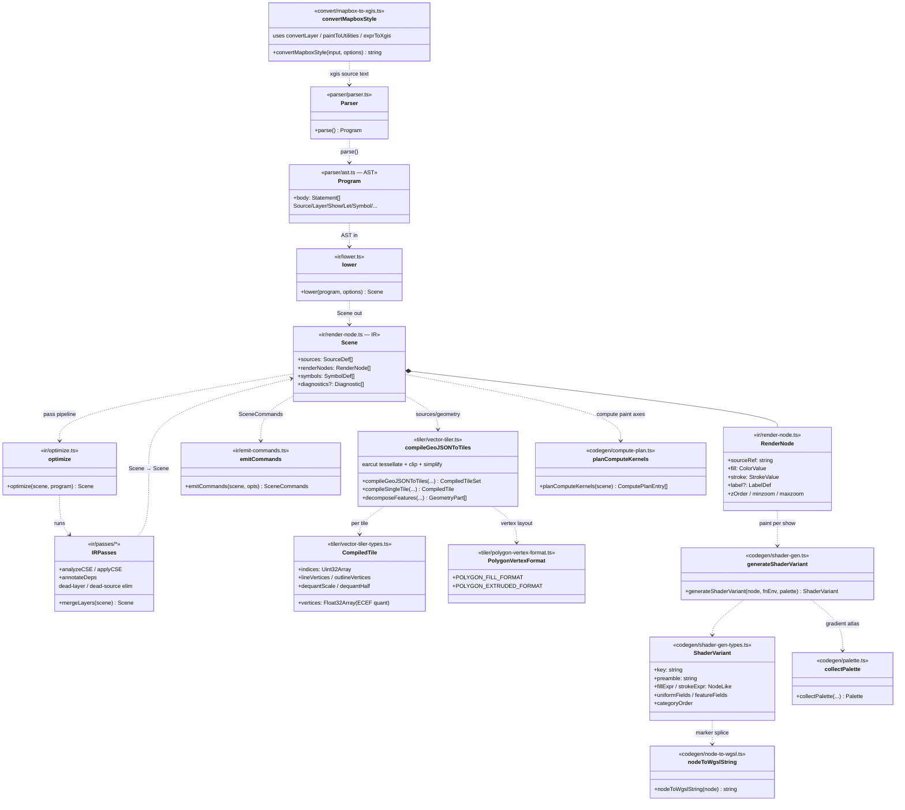

# Class Diagram — Compiler Pipeline

UML class/stage view of the `compiler/` package — the offline path that
turns a `.xgis` style (or an imported Mapbox/MapLibre style) into the IR,
GPU-ready `.xgvt` tiles, and WGSL shader variants the runtime consumes.

Grounded in `compiler/src/index.ts` (the public barrel), `compiler/src/AGENTS.md`,
and the stage entry points: `convert/mapbox-to-xgis.ts`, `parser/parser.ts` +
`parser/ast.ts`, `ir/lower.ts` + `ir/render-node.ts` + `ir/optimize.ts` +
`ir/emit-commands.ts`, `ir/passes/merge-layers.ts`, `tiler/vector-tiler.ts` +
`tiler/vector-tiler-types.ts` + `tiler/polygon-vertex-format.ts`, and
`codegen/shader-gen.ts` + `codegen/shader-gen-types.ts` + `codegen/node-to-wgsl.ts`

- `codegen/compute-plan.ts` + `codegen/palette.ts`.

> The pipeline is **text-in / data-out**: there is no single `Compiler`
> class. Each stage is a free function (`convertMapboxStyle`, `Parser.parse`,
> `lower`, `optimize`, `compileGeoJSONToTiles`, `generateShaderVariant`) that
> consumes the previous stage's product. The diagram shows those functions as
> stages and the **data types** that flow between them.

## Reading notes

- **No god `Compiler` object.** `index.ts` is a pure barrel; the pipeline is a
  chain of free functions. The canonical happy path is
  `convertMapboxStyle?` → `new Parser(src).parse()` → `lower(program)` →
  `optimize(scene)` → then two sinks: `compileGeoJSONToTiles` (geometry →
  `CompiledTile`) and `generateShaderVariant` (paint → `ShaderVariant`).
- **`convert/` is the optional front door, and it emits _text_, not IR.**
  `convertMapboxStyle(input, options)` returns a **`string`** of `.xgis`
  source (built from `convertLayer` / `paintToUtilities` / `exprToXgis` /
  `filterToXgis`), which then re-enters the normal `Parser` path. It does not
  short-circuit into a `Scene`.
- **`Scene` is the IR hub.** `lower` produces it; `optimize` and the
  `ir/passes/*` transforms (`mergeLayers`, `analyzeCSE`/`applyCSE`,
  `annotateDeps`, dead-layer / dead-source elimination) are all
  `Scene → Scene`. `emitCommands` turns a `Scene` into the imperative
  `SceneCommands` (`LoadCommand` / `ShowCommand`) the runtime replays.
- **Two terminal artifacts, two layouts.** The tiler packs geometry into the
  quantized **ECEF** vertex layout on `CompiledTile` (`vertices`/`indices`,
  `dequantScale`/`dequantHalf`, plus DSFUN line/outline arrays) using
  `POLYGON_FILL_FORMAT` / `POLYGON_EXTRUDED_FORMAT` and `earcut` tessellation.
  The codegen packs paint into a `ShaderVariant` whose `fillExpr`/`strokeExpr`
  are DSL `NodeLike` values rendered to WGSL via `nodeToWgslString`.
- **Compute is planned, not dispatched, at compile time.**
  `planComputeKernels(scene)` walks the `Scene` and returns
  `ComputePlanEntry[]` (one per `(renderNode, paintAxis)` needing a kernel);
  the runtime owns the actual GPU dispatch — see the compute-plan header note.

## Cross-links

- [ADR-0001 — ECEF tile pipeline (single MVP, ellipsoid vertices)](../../adr/0001-ecef-tile-pipeline.md)
  — why `CompiledTile.vertices` ship in the quantized ECEF layout.
- [ADR-0003 — Shader DSL single-emit + PROJECTIONS table as source of truth](../../adr/0003-shader-dsl-single-emit.md)
  — why paint lowers to DSL `NodeLike` and a single `generateShaderVariant`
  emit path (`nodeToWgslString` splice point).
- Diagram index: [README.md](./README.md) — see also
  [class-render-subsystem.md](./class-render-subsystem.md) for the runtime
  consumer of `CompiledTile` + `ShaderVariant`.
- Stage docs: `compiler/src/AGENTS.md` plus per-stage
  `parser/`, `convert/`, `ir/`, `ir/passes/`, `tiler/`, `codegen/` AGENTS.md.
