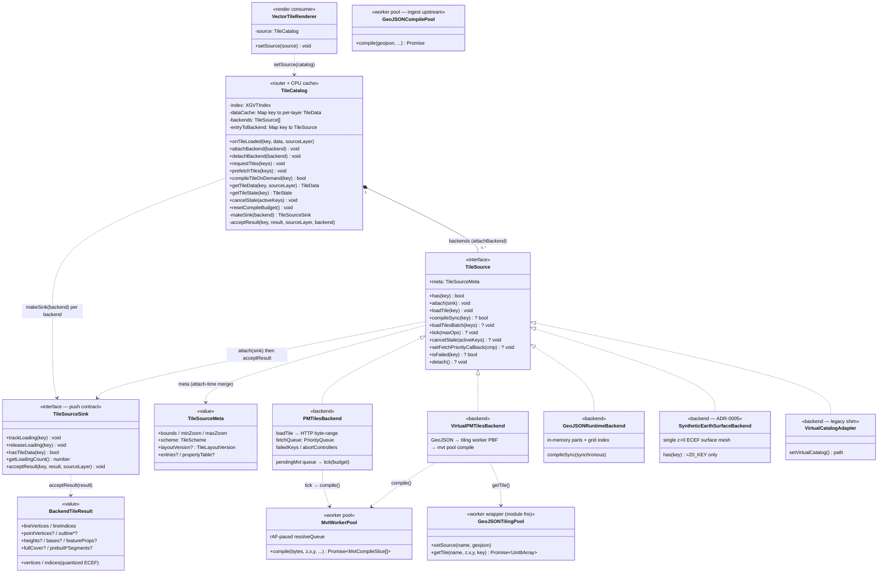
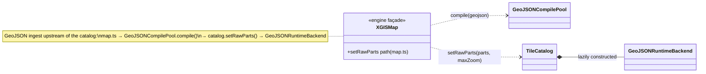

# Class Diagram — Data / Source Layer

UML class view of the tile data layer (`runtime/src/data/`). Shows how the
`TileCatalog` router/cache owns N per-format `TileSource` backends, how
results flow back through the push-based `TileSourceSink`, and where the
off-thread decode pools sit. Grounded in `data/tile-source.ts`
(`TileSource` / `TileSourceSink` / `TileSourceMeta` / `TileScheme`),
`data/tile-catalog.ts` (`TileCatalog` — `attachBackend`, `dataCache`,
`makeSink`, `acceptResult`), `data/sources/*.ts` (the backend impls), and
`data/workers/*.ts` (the decode pools). The renderer wiring point is
`engine/map.ts:483` (`vtRenderer.setSource(catalog)`) and
`engine/render/vector-tile-renderer.ts:578` (`setSource(source: TileCatalog)`).

> 핵심 분리: `TileCatalog` 는 포맷-비의존(cache / eviction / budget /
> sub-tile / `onTileLoaded` fan-out)만 담당하고, 포맷별 fetch/decode 는
> 각 `TileSource` 백엔드가 가진다. 결과 전달은 promise-return 이 아니라
> `TileSourceSink.acceptResult` push 방식 — XGVT-binary 의 HTTP range
> batch 와 PMTiles 의 per-MVT-layer slice 를 한 인터페이스로 흡수하기
> 위함 (`tile-source.ts` 헤더 주석 참조).

## Reading notes

- **Composition (`*--`)** = `TileCatalog` owns the lifetime of its attached
  `TileSource` backends. `attachBackend(backend)` calls `backend.attach(sink)`,
  pushes it onto `backends[]`, merges `meta`, and checks `layoutVersion`
  (`tile-catalog.ts:254`). `GeoJSONRuntimeBackend` is the one backend the
  catalog *constructs itself* — lazily inside `setRawParts`.
- **Realization (`<|..`)** = each backend `implements TileSource`. Confirmed
  classes under `data/sources/`: `PMTilesBackend`, `VirtualPMTilesBackend`,
  `GeoJSONRuntimeBackend`, `SyntheticEarthSurfaceBackend`,
  `VirtualCatalogAdapter`. There is **no** standalone `xgvt-backend.ts` /
  `tilejson-backend.ts`: the **XGVT-binary** path lives only as the optional
  `loadTilesBatch` + preregistered `meta.entries` contract on the interface
  (HTTP range-merge), and **TileJSON** sources reach the catalog through the
  same `prewarmSkeleton` / fetch path as the others — no dedicated class.
- **Push contract (`TileSourceSink`)** — the catalog hands each backend a
  *fresh* sink via `makeSink(backend)` (one per backend, not a singleton) so
  `acceptResult` can stamp `originBackend` for per-backend eviction. A backend
  is fire-and-forget: `loadTile(key)` returns void and later calls
  `sink.acceptResult(key, result, sourceLayer)` (or `null` for a miss). A
  `BackendTileResult` is the geometry payload; the catalog routes it to
  `cacheTileData` / `createFullCoverTileData`, synthesises an `XGVTIndex`
  entry, then fires `onTileLoaded` for GPU upload.
- **`compileSync` vs async** — only `GeoJSONRuntimeBackend` implements the
  optional synchronous `compileSync`; the catalog prefers it over async
  `loadTile` in `requestTiles` and gates it with the per-frame compile budget
  (`tryCompileSync`). PMTiles-family backends defer heavy decode to `tick()`.
- **Decode pools (`..>`, use-time)** — the off-thread decode lives in
  `data/workers/`. `PMTilesBackend.tick()` drains its `pendingMvt` queue
  through `getSharedMvtPool().compile(...)`. `VirtualPMTilesBackend` chains
  **both** pools: `GeoJSONTilingPool.getTile()` produces PBF bytes, then
  `MvtWorkerPool.compile()` decodes them — byte-identical to the PMTiles
  downstream half. `GeoJSONTilingPool` (`geojson-tiling-pool.ts`) is a
  module-function worker wrapper, not a class.
- **Ingest-upstream pool** — `GeoJSONCompilePool`
  (`geojson-compile-pool.ts`) is **not** a catalog/backend dependency. It runs
  in the `XGISMap` GeoJSON ingest path (`map.ts:2244` →
  `catalog.setRawParts()`), feeding the in-memory `GeoJSONRuntimeBackend`. The
  second mini-diagram isolates that upstream flow.
- **Scheme / layout versioning** — every shipping backend declares
  `scheme: 'web-mercator-xyz'` and `layoutVersion: TILE_LAYOUT_VERSION`
  (`tile-source.ts`). On attach the catalog evicts cached tiles whose layout
  doesn't match, so a runtime stride bump (PR 2c/2f) forces a clean re-decode.

## Related

- The runtime trip of one tile (fetch → decode → cache → upload → draw) is
  the sequence in [sequence-tile-lifecycle.md](./sequence-tile-lifecycle.md).
- The render-side consumer (`VectorTileRenderer` and the pass chain) is
  [class-render-subsystem.md](./class-render-subsystem.md).
- The `SyntheticEarthSurfaceBackend` rationale (background fill as a synthetic
  z=0 ECEF tile, replacing `BackgroundRenderer`) is
  [ADR-0005](../../adr/0005-synthetic-earth-surface-background.md).
- The quantized-ECEF tile geometry the backends emit in `BackendTileResult` is
  [ADR-0001](../../adr/0001-ecef-tile-pipeline.md).
- Diagram index: [README.md](./README.md).
