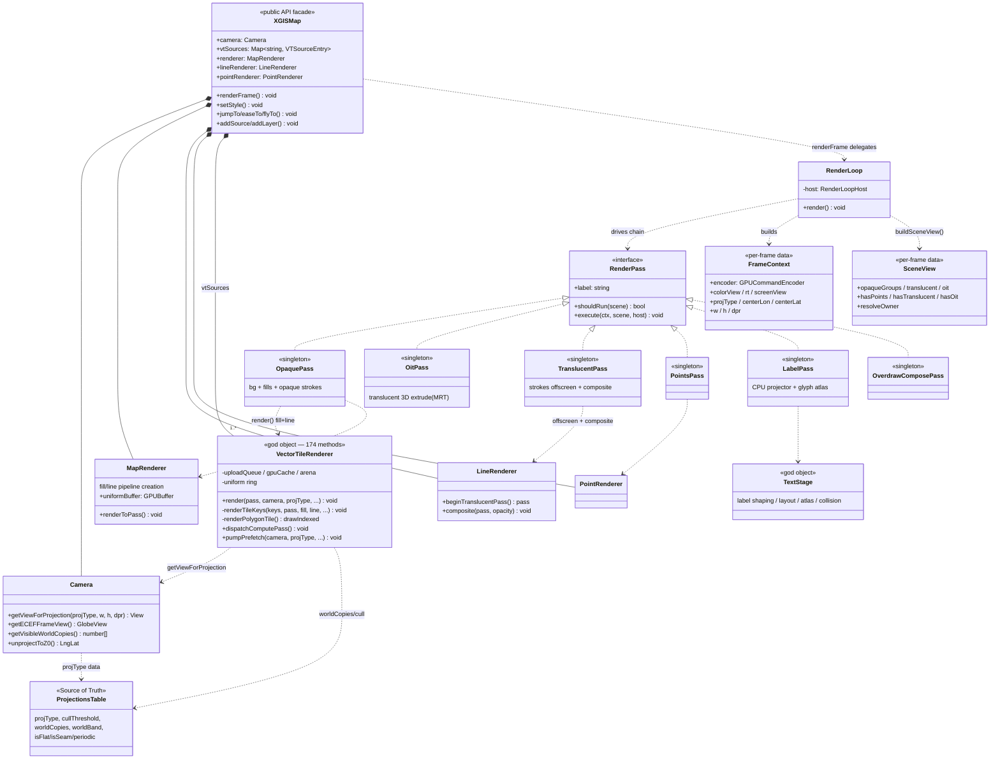

# Class Diagram — Render Subsystem

UML class view of the runtime render path (`runtime/src/engine/`). Shows
ownership (composition), the `RenderPass` chain, and the per-frame data
objects. Grounded in `map.ts`, `render-loop.ts`, `render/passes/*.ts`,
`vector-tile-renderer.ts`, `projection/camera.ts`.

> Known debt: `VectorTileRenderer` (5608 LOC / 174 methods) and `XGISMap`
> (2956 / 160) are **god objects** — unclear state-ownership. See
> [MODULES.md](../MODULES.md). The diagram shows their _current_ surface,
> not a target shape.

## Reading notes

- **Composition (`*--`)** = the owner allocates/owns lifetime. `XGISMap`
  owns one `Camera`, the shared renderers, and one `VectorTileRenderer`
  per vector source (`vtSources`). `VTSourceEntry` is not a named type — it
  is the inline object literal `{ source: TileCatalog; renderer:
VectorTileRenderer }` (`map.ts:159`), so each entry also owns a
  `TileCatalog` (omitted from the arrows to keep the box readable).
- **Dependency (`..>`)** = "uses at call time", no ownership. The passes
  are _stateless singletons_ (`render/passes/*.ts` export one instance);
  they reach renderers/camera through the `host: RenderLoopHost` view.
- **`ProjectionsTable`** (`projection/projections-table.ts`) is the single
  authority every projection-aware site reads — see
  [ADR-0003](../../adr/0003-shader-dsl-single-emit.md).
- The actual GPU draw of fills + strokes happens inside
  `VectorTileRenderer.renderTileKeys` (one tile = fill `drawIndexed` then
  line `drawIndexed`); see [sequence-frame-render.md](./sequence-frame-render.md).
