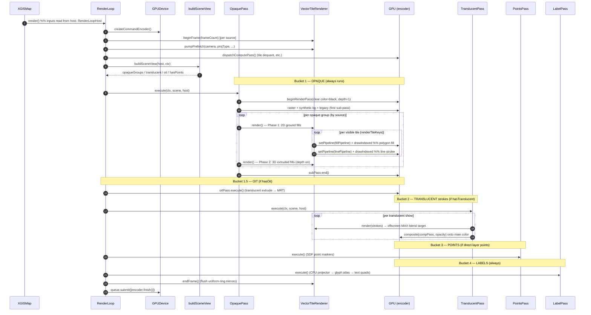

# Sequence Diagram — One Frame Render

How a single frame is encoded and submitted. Grounded in
`render-loop.ts` (`RenderLoop.render`), `render/passes/opaque-pass.ts`,
`translucent-pass.ts`, and `vector-tile-renderer.ts`
(`render` → `renderTileKeys`).

The render path is a **fixed linear chain of passes**, all encoded into
**one** `GPUCommandEncoder`, submitted once at the end.

## Why this order is fixed

Alpha compositing is only correct if **all opaque content finishes before
any translucent content blends over it**, regardless of the user's layer
declaration order. The bucket scheduler enforces:

1. **Opaque** (bg + fills + opaque strokes) — depth/stencil owned here.
2. **OIT** — order-independent translucency for 3D extruded buildings.
3. **Translucent strokes** — offscreen MAX-blend, then composited at the
   layer's resolved opacity.
4. **Points**, then **5. Labels** — always last, drawn over the map.

Within the opaque bucket, each group runs **two phases** (2D ground fills
with depth disabled = painter's order, then 3D extruded fills with depth
enabled) so cross-tile depth ordering is correct at high pitch / on the
globe — see `opaque-pass.ts`.

## Fill + line coordination (per tile)

Fills and strokes are **separate GPU pipelines** (different shaders, vertex
layouts, depth/stencil states — `gpu-shared.ts`) but drawn in the **same
sub-pass, same per-tile loop**, sharing the **same per-tile uniform slot**
(MVP, `proj_params`, dequant), the **same tile vertex cache**, and the
**same projection forward** (`shader-dsl/shaders/projections.ts`
`project_geom`/`flat_rel`).
This "coordinated separation" is the result of the projection-unification
work — see [ADR-0003](../../adr/0003-shader-dsl-single-emit.md) and
[ADR-0006](../../adr/0006-world-copy-rendering.md).
