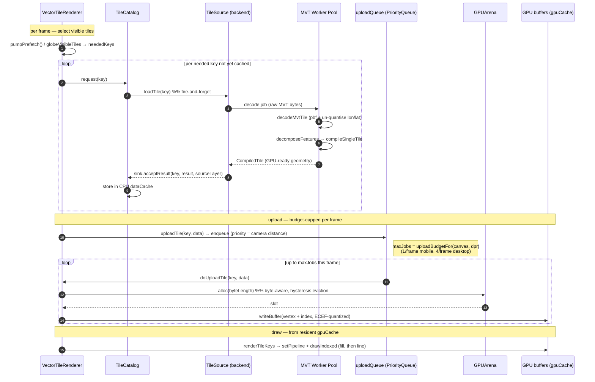

# Sequence Diagram — Tile Lifecycle (fetch → decode → upload → draw)

How one vector tile travels from a source backend to a GPU draw. Grounded
in `data/tile-source.ts` (the `TileSource`/`TileSourceSink` contract),
`data/workers/mvt-worker.ts` + `mvt-worker-pool.ts` (decode), `data/tile-catalog.ts`
(CPU cache), and `vector-tile-renderer.ts` (`uploadTile` → `doUploadTile` →
`renderTileKeys`).

Loading is **push-based**: a backend is fire-and-forget; results arrive
asynchronously via `sink.acceptResult`. Decode runs **off the main thread**
(worker pool) for the MVT/PMTiles path.

## Key properties

- **TileSource contract** (`data/tile-source.ts`): `attach(sink)` once,
  then `loadTile(key)` is fire-and-forget; the backend pushes
  `sink.acceptResult(key, result, sourceLayer)` (or `null` for missing).
  `has(key)` is a cheap synchronous predicate the catalog uses to avoid
  redundant fetches. XGVT-binary backends may implement `loadTilesBatch`.
- **Off-thread decode**: `mvt-worker.ts` does `bytes → decodeMvtTile →
decomposeFeatures → compileSingleTile`, resolved through an rAF-driven
  queue in `mvt-worker-pool.ts`. The GeoJSON path has its own compile +
  tiling worker pools.
- **Two caches, two pressures**:
  - **CPU** `TileCatalog.dataCache` (decoded geometry) — evicted by count.
  - **GPU** `gpuCache` (vertex/index buffers in `GPUArena`) — evicted by
    **bytes** with a 75 %/60 % hysteresis band, since tile sizes vary by
    zoom; count-only eviction crashed the globe at z10–11
    (see [GPUArena OOM fix](../../../runtime/src/engine/render/vector-tile-renderer-helpers.ts)).
- **Budget split gotcha**: the GPU cache cap `getMaxGpuTiles()` keys off
  `window.innerWidth`, while `uploadBudgetFor()` keys off the _canvas_ CSS
  width — a known latent width-basis mismatch documented in the renderer
  helpers (harmless in practice; surfaced during the equirect-drag
  investigation).
- **Fallback**: if a needed tile isn't resident, the renderer draws a
  parent/ancestor tile clipped to the child's stencil ID until the primary
  arrives (`renderTileKeys` fallback path).

## Related

- The draw step expands in [sequence-frame-render.md](./sequence-frame-render.md).
- Tile geometry packing is [ADR-0001](../../adr/0001-ecef-tile-pipeline.md).
