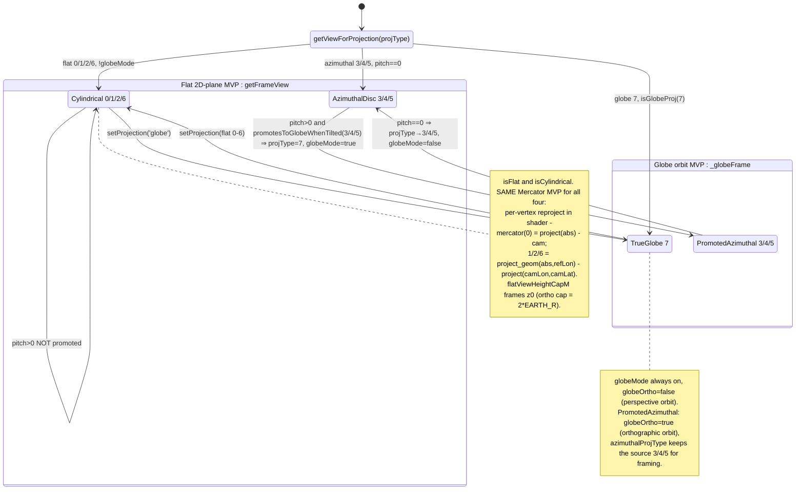

# State Diagram — Projection Rendering Modes

The view-matrix mode the renderer drives per frame, and the transitions
between modes as the user changes projection or tilts the camera. Grounded
in `projection/camera.ts` (`getViewForProjection` routing, the `globeMode` /
`globeOrtho` flags, `getFrameView` vs `getECEFFrameView`, `_globeFrame`),
`projection/projections-table.ts` (the 8 `projType` rows + the
`isFlat`/`isGlobe`/`isCylindrical`/`isSeam`/`periodic` columns +
`promotesToGlobeWhenTilted` / `routeToSphereSelector`), and the per-frame
promotion in `render-loop.ts` (`render` → `azimuthalTilted`).

The core fact: **ECEF is the data coordinate system, but the *display*
projection is a separate concern** (camera.ts:681-684). Every projType maps
the same ECEF surface to the screen through exactly one of three view
matrices, chosen by `getViewForProjection(projType, …)`:

- **Flat 2D-plane MVP** — `getFrameView` → `_buildRTCMatrix`, the legacy
  Mercator-metre RTC matrix. Curved ECEF data is flattened *per vertex* in
  the shader (`project_geom(abs, refLon) − project(camLon, camLat)`), so one
  Mercator MVP serves every flat projType. Selected when
  `!globeMode && !isGlobeProj(projType)` (camera.ts:715-716).
- **ECEF-ENU MVP** — `getECEFFrameView`, an ENU-metre matrix at the camera
  anchor. (Used by the polygon/line/point ECEF pipeline; the flat display
  path revives `getFrameView` instead — camera.ts:476-481.)
- **Globe orbit MVP** — `_globeFrame` → `buildGlobeMatrix`, the 3D
  orbit-camera view-proj. Reached whenever `globeMode` is on
  (camera.ts:503-505, 555-557).

## Reading notes

- **projType ↔ wire value.** The `PROJECTIONS` array index *is* `projType`
  *is* the shader `proj_params.x` int (projections-table.ts:7, 51). The 8
  rows in order: `0 mercator`, `1 equirectangular`, `2 natural_earth`,
  `3 orthographic`, `4 azimuthal_equidistant`, `5 stereographic`,
  `6 oblique_mercator`, `7 globe`. The shader takes its flat branch exactly
  when `proj_params.x < 6.5`, so the matrix selector and the VS branch stay
  in lockstep (camera.ts:699-700).

- **One Mercator MVP for every flat projType.** `getViewForProjection` hands
  flat projTypes (0-6, untilted) the *same* `getFrameView` →
  `_buildRTCMatrix` 2D-plane matrix (camera.ts:686-692). The projections
  differ only in the *per-vertex* forward applied in the shader — mercator
  via `project(abs) − cam`, the rest via
  `project_geom(abs, refLon) − project(camLon, camLat)`. `flatViewHeightCapM`
  caps the z0 view height so each disc/strip frames the canvas; the cap
  binds only for ortho (3 → `2·EARTH_R`), everything else takes `WORLD_MERC`
  (projections-table.ts:183-185).

- **The promotion set is exactly {3,4,5}.** `promotesToGlobeWhenTilted` is
  defined as `!isFlat && !isGlobe && !isCylindrical`, which over the table
  resolves to orthographic / azimuthal_equidistant / stereographic only
  (projections-table.ts:143-146). The render loop computes
  `azimuthalTilted = promotesToGlobeWhenTilted(projType) && camera.pitch > 0`
  and, when true, overwrites `projType = 7` and sets
  `camera.globeMode = isGlobeProj(projType)` (render-loop.ts:152-161). At
  `pitch=0` they stay on their exact 2D disc (so stereographic ≠ ortho is
  preserved); at `pitch>0` they become true spheres.

- **Cylindrical (0/1/2/6) stay flat under pitch — by design, with one latent
  gap.** They are `isCylindrical`, so `promotesToGlobeWhenTilted` excludes
  them and they keep the flat MVP at any pitch. The table comment flags that
  `oblique_mercator (6)` nonetheless sphere-*routes* its tiles
  (`routeToSphereSelector` → `!isFlat && !isGlobe` = {3,4,5,6}) while staying
  flat in the MVP — "flat MVP + sphere tiles", an explicit deferred bug, not
  a drawn state (projections-table.ts:119-146).

- **Two distinct globe sub-modes.** `globe (7)` is always `globeMode` with
  `globeOrtho=false` (perspective orbit). A *promoted* azimuthal disc runs
  with `globeOrtho=true` (orthographic orbit — no perspective foreshortening,
  byte-identical to the flat disc at `pitch=0`) and preserves its source
  projType in `azimuthalProjType` so `_globeFrame` → `buildGlobeMatrix` can
  apply the right view-height cap across the `pitch=0` boundary
  (camera.ts:54-76, 319-331).

## Cross-links

- [ADR-0002 — Geoid split (sphere camera / ellipsoid vertices)](../../adr/0002-geoid-sphere-camera-ellipsoid-vertex.md)
  — why the globe orbit basis and the ECEF vertices live on different
  surfaces (the ~21 km seam the mode split has to tolerate).
- [ADR-0003 — Shader DSL single-emit + PROJECTIONS table as source of truth](../../adr/0003-shader-dsl-single-emit.md)
  — why the 8-row table is the single authority for `projType` behaviour
  (`isFlat`/`isGlobe`/`promotesToGlobeWhenTilted` all derive from it).
- [ADR-0006 — Per-projType world-copy enumeration](../../adr/0006-world-copy-rendering.md)
  — how the `periodic` / `isCylindrical` columns drive the antimeridian
  world-copy emission that the flat (non-globe) modes rely on.
- [Diagrams index](./README.md) · [class-render-subsystem.md](./class-render-subsystem.md)
  (the `ProjectionsTable` SoT in the render graph) ·
  [sequence-frame-render.md](./sequence-frame-render.md).
