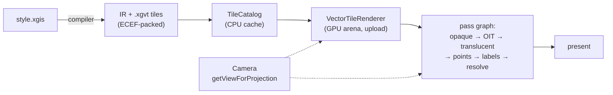

# X-GIS Runtime — Redesign Vision (revised after adversarial review)

> **Status: VISION / PROBLEM-FRAMING — revised.** Not a plan, not code. First
> written 2026-06-02 after a 56-cell render-matrix sweep suggested the bugs share
> a shape; **revised the same day** after a six-persona adversarial review
> (renderer architect · cartography/projection expert · YAGNI staff architect ·
> pragmatic CTO · portfolio/hiring reviewer · verification skeptic) checked every
> load-bearing claim against the actual code.
>
> **What the review changed.** The *core insight* survives — but the "single
> three-model Frame framework" framing did **not**, and one headline claim was
> **factually wrong about this engine's own code**. This revision: (1) corrects
> that error, (2) deflates the "framework" to **one invariant + a few scoped
> fixes**, (3) re-anchors verification on numeric invariants (the screenshot
> matrix is a *discovery tripwire*, not a gate), (4) names **clip-and-suture** as
> the real unsolved projection primitive instead of laundering it through a scope
> tag, (5) adds a cross-library grounding section, and (6) adds an abort gate.
> The honest one-liner: **this is two fixes and a test invariant, documented —
> not a runtime rebuild.**

## 0. Ground truth (decided)

- **Purpose:** learning / **portfolio — technical proof.** X-GIS exists to
  demonstrate that a *correct, fast, coherently-architected* WebGPU GIS engine
  can be built. **The architecture quality IS the deliverable** — not shipping a
  product. So "world-class, legible, gap-free design" is the actual success bar.
- **Scope (locked):**
  - **CORE (must be pixel-perfect):** `mercator` (the flat standard) + `globe`
    (true 3D sphere — the "wow").
  - **SHOWCASE (must be correct):** the pseudo-cylindrical family —
    `equirectangular`, `natural_earth`, room for `robinson` / `mollweide` /
    `eckert` via the projection DSL. Bounded interiors; the **antimeridian seam is
    a real, still-open suture problem here** (see §5) — not "free".
  - **EXPERIMENTAL (renders, not pixel-gated):** the azimuthal disc family —
    `orthographic` / `azimuthal_equidistant` / `stereographic`. **These render
    today and will keep rendering.** They are simply **not held to the
    pixel-perfect bar**, because their correctness needs a primitive X-GIS does
    not yet have (spherical clip-and-suture — §2.2). *Honest framing:* this is
    "not gated yet," **not** "out of scope" and **not** "broken." Do not let the
    scope tag launder *unsolved* into *descoped*.

---

## 1. What the runtime DOES today (honest)

The pipeline, as it actually is:

**What it does well (real, keep it):** one projection forward (`projections.ts`)
shared by all GPU surfaces; one `PROJECTIONS` table as source of truth; one ECEF
tile geoid; a clean multi-bucket pass scheduler; a synthetic earth-surface fill
that already paints the style background **inside** the projected world band
(`earth-surface-fill.ts`, merged PRs #164/#165). The *math* is unified and a real
chunk of "coverage" already ships.

**Where it actually leaks** — corrected after the review:

- **Coverage of the region *outside* the world band is undefined-by-default, by
  an intentional convention.** This is the one the matrix made loud, and the
  earlier draft of this doc got it **wrong**. The black you see around a shrunk
  disc / above a pitched horizon / in the low-zoom letterbox is **not an
  accidental "clear-value fallthrough."** It is a **deliberate decision**:
  `opaque-pass.ts:86-95` documents that the opaque clear stays pure black
  `{0,0,0,1}` *"same convention as MapLibre … restoring pixel parity at the z=0
  p=60 cell"*, ratified in `ADR-0005` (*"background is additive on top of that
  clear, not a replacement"*) and pinned by `opaque-pass-clear-value.test.ts`.
  **So the real gap is narrow and true:** nothing paints the outside-band region
  with anything *other than* black, and for CORE/SHOWCASE we now want to **change
  that chosen convention** (defined letterbox / sky / space), *not* to fix a bug.
  Say it as a deliberate reversal, not a discovery.

- **Labels are a separate CPU-placed subsystem.** *(Anchors do **not** drift —
  the pitch diagnosis proved CPU and GPU anchors are byte-identical across pitch.)*
  The real gap is one missing **feature**: labels are screen-space **billboards**
  with no `text-pitch-alignment: map`, so glyphs never lie on the tilted ground.
  Note this is a *feature*, not a model: labels are an irreducibly separate
  placement engine (collision index + glyph/icon atlas + world-copy iteration),
  not "fill with a different shader" (§2.1).

- **Per-projection camera framing is ad-hoc**, so a disc can shrink under pitch
  (the framing rule lives scattered, not as a property of the projection).

- **Projections have no clip-and-suture primitive.** "Valid extent" is a scalar
  `cullThreshold` (`projections-table.ts`: ortho `0.0`, azimuthal `-0.85`, stereo
  `-0.8` — un-derived constants: single-sourced and drift-pinned, but with no
  geometric justification in the comment), applied **per vertex**. A per-vertex kill cannot cut a triangle that straddles a boundary, so
  the azimuthal limb / antipode and the antimeridian seam tear. This is the real
  reason the disc family can't be made pixel-perfect — see §2.2.

These are **not "one missing idea seen from four sides"** (that was rhetoric the
review punctured). They are **four genuinely distinct concerns** that happen to
share a theme: *the runtime has no single, defined answer to "what fills each
pixel, and where does each projection stop?"* The honest unifier is **one test
invariant** (§4), not a framework.

---

## 2. How the reference engines are built (and where X-GIS differs)

*The most useful part of the review was the cross-library grounding — it shows
which of our "bugs" are really unbuilt primitives that mature engines solved
years ago. Three comparisons, each pinned to a concrete X-GIS gap.*

### 2.1 MapLibre / Mapbox GL — one Transform, one Painter, **symbols apart**

MapLibre's coherence comes from **one `Transform`** (all camera + projection
state) that **every** layer reads, and **one `Painter`** that draws each layer in
order. Fill / line / circle / raster are GPU per-vertex geometry that "differ
mostly by shader." **Symbols are not in that club.** They are a whole separate
pipeline: `SymbolBucket` + a CPU `Placement` step + a screen-space
`CollisionIndex` + a glyph/icon SDF atlas, with `text-pitch-alignment` /
`text-rotation-alignment` (the map-vs-viewport alignment axis; both default to
`auto`) as first-class properties.

- **X-GIS already matches the good part:** one forward projection + one
  `PROJECTIONS` table all surfaces read (our `Transform` analogue), and a pass
  scheduler (our `Painter` analogue).
- **Where X-GIS differs / must respect the boundary:** the earlier draft said
  labels "differ only by shader." **False** — `label-pass.ts` self-describes as
  "the largest pass: world-copy iteration, four anchor projectors, point/line
  placement, icon dispatch, screen-space collision + atlas." Like MapLibre, the
  *projected anchor* shares the one transform (already true today); the *symbol
  pipeline* is irreducibly separate. The only win available is the **one missing
  property** (`text-pitch-alignment: map`), shipped as a feature — **not** a
  rewrite of the dominant CPU hot path (memory: label dispatch ~10.93 ms, p95
  ~107 ms high-pitch drag).
- **The black-outside-world is MapLibre's convention too**, which is exactly why
  `opaque-pass.ts` adopted it. Our change is a *deliberate* departure for
  CORE/SHOWCASE, knowingly trading a sliver of MapLibre pixel-parity for "no
  accidental black."

### 2.2 d3-geo — a projection's valid extent **is a clip-and-suture**, not a scalar

d3-geo (the reference for "an engine that handles arbitrary projections") models
a projection as a **stream transform** whose domain is enforced by **clipping**:
`clipAntimeridian` (default pre-clip — cuts a feature at λ=±180° and **re-stitches**
the boundary so a polygon crossing the seam stays one closed ring) and
`clipCircle(angle)` (for azimuthals / orthographic — cuts at the small-circle
limb and inserts the boundary arc). **Clip-and-resuture is the core primitive of
a projection engine**, and it is what makes the *interesting* projections correct.

- **Where X-GIS differs (the real unsolved problem):** X-GIS has **no clip-and-
  suture anywhere**. It has a per-vertex `cullThreshold` (keeps or kills whole
  primitives → torn edges) and, for the azimuthal family, the shader literally
  flings the far hemisphere to `vec2(1e15, 1e15)` past `cos_c < -0.9` instead of
  clipping it.
  Consequently:
  - the **azimuthal disc family can't be pixel-perfect** — hence EXPERIMENTAL.
    The honest statement is *"we have not built `clipCircle`,"* not *"these
    projections are out of scope."*
  - the **antimeridian seam in equirect / natural_earth** (the SHOWCASE tier we
    call "correct") needs a forest of ε-biased world-copy patches
    (`unwrap_lon_near_keep`, `SEAM_KEEP_EPS`, the NE-lobe wedge fix). That is a
    **world-copy suturing** gap — a *forward-projection geometry* problem the
    coverage invariant does **not** touch. Naming it honestly: clip/suture is a
    named, still-open primitive, tracked separately from coverage.
- **Inverse honesty:** d3-geo gives most projections an `.invert` (closed-form or
  Newton). X-GIS's only working inverse is Mercator (`inv_merc_lat_rad`);
  `unprojectGlobe` exists and is used for globe **tile-selection** (`globe.ts`, via
  `globeVisibleTiles`) but is **not** wired into the interaction/**pick** path —
  globe-pick is unimplemented (memory #8 audit). So "each projection is a complete
  object with forward/inverse/extent" is **aspirational** — state it as a target,
  not a current property.

### 2.3 Cesium / MapLibre globe — atmosphere is a **separate screen-space pass**

A believable globe (the CORE "wow") gets its limb glow from **atmospheric
scattering**: a separate post-geometry, depth-reading screen-space pass whose glow
extends **beyond** the sphere silhouette into space (Cesium draws it on a backing
ellipsoid slightly larger than the globe; MapLibre v3 globe blends it offscreen).
Either way it is **its own pass, not a flat background color**.

- **Where X-GIS differs / must decide:** the earlier draft listed "atmosphere" as
  a flat *coverage* state and simultaneously asked in §6 whether it needs a real
  shader. Pick one: for a portfolio whose CORE wow is the sphere, atmosphere is a
  **committed separate screen-space scattering pass** (depth-tested against the
  globe), **not** a coverage color. This is a fourth kind of thing and it's fine —
  it just means the render model is *a pass graph*, not "one ordered layer stack"
  (§2.4).

### 2.4 The lesson: a GPU frame is a **pass graph**, not a 2D layer stack

The single biggest framework error in the first draft was *"every pixel is
accounted for by exactly one well-defined layer of a single ordered model."* On
this engine's own hot path that is **false**: a pixel inside a translucent
extrusion is written by the synthetic background, the opaque fills, the OIT accum
pass, the OIT revealage pass, the compose pass, and the MSAA resolve — **six
writes across four render targets**, arbitrated by `clearValue` + depth + stencil
(`renderer.ts` carries ≥6 depth/stencil variants) + offscreen composites. That is
a **pass graph**, exactly like MapLibre's Painter and Cesium's frame.

So the surviving idea must be stated as an **authoring / test invariant**
("every viewport pixel has a *defined source*"), **not** as a literal GPU
rendering invariant ("one ordered layer owns each pixel"). Depth/stencil and the
multi-pass composite are the *real* arbiters of "what fills each pixel"; the
invariant rides **on top** of the pass graph, it does not replace it.

---

## 3. What we WANT (requirements)

Two users, one bar.

**The map viewer (end user of any map X-GIS renders):**
- Every viewport pixel has a **defined source** on CORE/SHOWCASE — letterbox →
  background; sky above a pitched horizon → background/sky; around a globe →
  space/atmosphere. **No pixel falls to black by accident.** (This is the user's
  original complaint, and it is the *one* thing a coarse screenshot can check
  reliably — a per-cell black-pixel-ratio assertion. §4.)
- Labels **sit on the map** (`text-pitch-alignment: map`) and stay readable.
- Every **CORE/SHOWCASE projection × pitch × zoom** renders correctly. (Azimuthal
  EXPERIMENTAL renders, but is not pixel-gated until clip-and-suture exists.)
- Fast and smooth — no crash under real data; no jank on pan/zoom/pitch.

**The developer (this project's reason to exist — portfolio):**
- Adding a projection or a surface is a **localized** change.
- The architecture is **legible**: a reader can predict *coverage* and
  *projection* from the model. *(The pass/depth/stencil machinery is irreducibly
  detailed and documented per-pass — legibility is "predict coverage + framing,"
  not "hold the whole OIT/stencil graph in your head," which the review correctly
  flagged as unattainable.)*
- Correctness is **gated by deterministic numeric invariants** that run in CI,
  with the real-GPU visual matrix as the **discovery tripwire** that *surfaces*
  what to turn into an invariant. *(Corrected from the first draft, which inverted
  this — see §4 and §6.)*

---

## 4. The one idea that survives: **every pixel has a defined source**

Stripped of the framework, the redesign is **one invariant**:

> **On CORE/SHOWCASE, for every `(projection, camera, zoom, pitch)`, every pixel
> of the viewport is painted by a *defined* layer — never left to black by
> accident.** "Empty" (letterbox / sky / space) is a *chosen* layer, not a
> fallthrough.

This is genuinely good, it is the user's actual complaint, and crucially it is
**numerically gateable**: a per-cell assertion on the black-pixel ratio (and, for
the globe, "no black inside the expected sky/space region"). That single
invariant is the spine; everything else is scoped work, not a model.

**What the invariant does NOT fix** (the review's most important calibration —
own this, don't over-claim):

| Bug class | Fixed by the invariant? | Why |
|---|---|---|
| Black void where bg/sky/surround expected (BUG-A/B/C) | **Yes** — this *is* the invariant | coverage outside the world band |
| Labels billboard / don't lie on the tilted ground | **No** — separate **feature** | needs `text-pitch-alignment: map`, not coverage |
| Disc shrinks under pitch | **No** — separate **framing** fix | framing belongs on the projection (§5) |
| Antimeridian seam / NE-wedge (equirect/NE) | **No** — separate **suture** gap | world-copy stitching, a forward-geometry problem (§2.2) |
| Azimuthal limb/antipode tear | **No** — needs **clip-and-suture** | the unbuilt d3-geo `clipCircle` primitive (§2.2) |
| Precision (#210 f32 cancellation) | **No** — orthogonal | numeric, not coverage |
| Arena OOM | **Already fixed** (#193 byte-aware eviction) | stale; do **not** re-justify a rebuild with it |

The first draft's "dissolves the bug classes by construction" was an over-claim.
The invariant **eliminates the coverage-fallthrough class, full stop.** Precision,
suture, framing, and resource bugs are *orthogonal* and tracked separately.

---

## 5. The actual gaps (named honestly, not as "models")

The first draft sold "① Projection / ② Coverage / ③ Surface" as three composable
models. The review showed ② is ~80% built, ① is a table column, and ③ is one
feature. So the honest list of *work*, smallest-to-largest:

1. **Outside-band coverage** *(the real, small gap — the headline fix).*
   Add a **defined non-black layer** for the region *outside* the world band:
   a flat letterbox/background base for flat projections; **space + a committed
   atmosphere scattering pass** for the globe (§2.3). This sits **behind** the
   existing synthetic earth-surface and **knowingly reverses** the deliberate
   black-clear convention (`opaque-pass.ts`, ADR-0005) for CORE/SHOWCASE. Roughly
   1–3 targeted PRs, gated by a black-pixel-ratio assertion.

2. **`text-pitch-alignment: map`** *(one feature, not a model).* Ground-aligned
   label glyphs. Ship as a scoped feature on the existing label pipeline. **Do
   not** migrate the CPU label projector onto the GPU "for consistency" — the doc
   itself concedes there is no drift, and it is the dominant CPU hot path.

3. **Framing as a projection property** *(a column, not a model).* Move the
   per-projection camera framing rule onto the `PROJECTIONS` table so a disc can't
   shrink under pitch. Extension of the existing SoT table.

4. **Clip-and-suture** *(the real unsolved projection primitive — §2.2).* A
   spherical clip region (`clipCircle` for azimuthal/globe limb, `clipAntimeridian`
   + world-copy suture for cylindricals) that **cuts straddling primitives and
   re-stitches the boundary**, in the same projected frame. This is the prerequisite
   for promoting any azimuthal projection out of EXPERIMENTAL, and for retiring the
   ε-biased seam patches in SHOWCASE. **Largest item; explicitly optional** for the
   portfolio — but name it as the honest "this is what a projection engine's hard
   part actually is," not a scope tag.

Resources (the GPU arena) are **already** byte-aware-evicting (#193) — **not** a
gap; removed from this list.

---

## 6. Migration (scoped fixes + abort gate)

Not a rewrite. A small ordered set of fixes, each shipped the way the last ~12 PRs
shipped (targeted, matrix-surfaced, numerically gated):

1. **Lock the invariant + this doc.** Keep the Frame model as an **ADR / written
   rationale** — for a portfolio, a crisp written architecture doc delivers most
   of the "legibility" deliverable at ~zero schedule risk. Do **not** build a new
   `Scene`/`Frame` object that duplicates the existing `FrameContext` /
   `SceneView` / `RenderTargets` / `RenderLoop`; if anything emerges, it must be
   the **seam that falls out of decomposing the 5.6k-LOC VTR**, reusing those.
2. **Outside-band coverage** (gap #1) — the highest-leverage single change and the
   cleanest proof. **The deliverable is a merged PR with a black-pixel-ratio
   assertion going green**, not the diagram.
3. **`text-pitch-alignment: map`** (gap #2) — scoped feature.
4. **Framing column** (gap #3).
5. **(Optional, largest) clip-and-suture** (gap #4) — only if pursued; promotes
   azimuthals and retires seam patches. Otherwise EXPERIMENTAL stays honestly
   labelled "renders, not gated."

**Verification (corrected — this is the part the first draft got most wrong):**
the real-GPU screenshot matrix is a **discovery tripwire** (it *surfaces* visual
bugs; it cannot *gate* — `_matrix-scan.spec.ts` is a throwaway capture whose only
assertion is `records.length > 0`, and per ADR-0004 it can't run in CI: no GPU).
**Every bug the matrix surfaces must be reduced to a deterministic numeric
invariant before its step is "done":** coverage → per-cell paint/black-ratio;
labels → existing `_label-anchor-parity` + `_projection-label-onscreen` **+ a
draw-count assertion that must actually be built (it does not exist today)**;
framing → projected-extent-vs-viewport check; math → the existing CI
compute-parity gates. The granular CI invariants are what **catch** regressions;
the screenshot only **finds new** ones. (This re-anchors on the
`docs/verification/STRATEGY.md` ladder the project already proved works.)

**Abort gate (new):** each step gets a day budget. **If any step regresses a
previously-green matrix cell or a green numeric gate, or exceeds budget — ship
what's green and stop.** The mid-migration state (two paradigms at once) is the
state a portfolio reviewer is *most* likely to see; never leave it incoherent.

---

## 7. Open design questions (for the target-architecture step)

- Atmosphere pass authoring for the globe (§2.3): single scattering vs a cheaper
  analytic limb glow — both are a separate depth-reading pass, decide the fidelity.
- Whether SHOWCASE pseudo-cylindricals are authored MapLibre-style (per-projection
  WGSL snippet) or stay in the single-emit DSL — and whether `clipAntimeridian`
  suture (§5 gap #4) is worth pursuing for them or the ε-patches stay.
- The seam that should fall out of the VTR/XGISMap decomposition
  ([[godfile-decomposition-review-2026-05-30]]) — reusing `FrameContext` /
  `SceneView` / `RenderLoop`, **not** a parallel new object.

*Decided in the next artifact (**target architecture**), checked against this
vision — and against the six personas' verified objections, summarized in the
review that produced this revision.*
